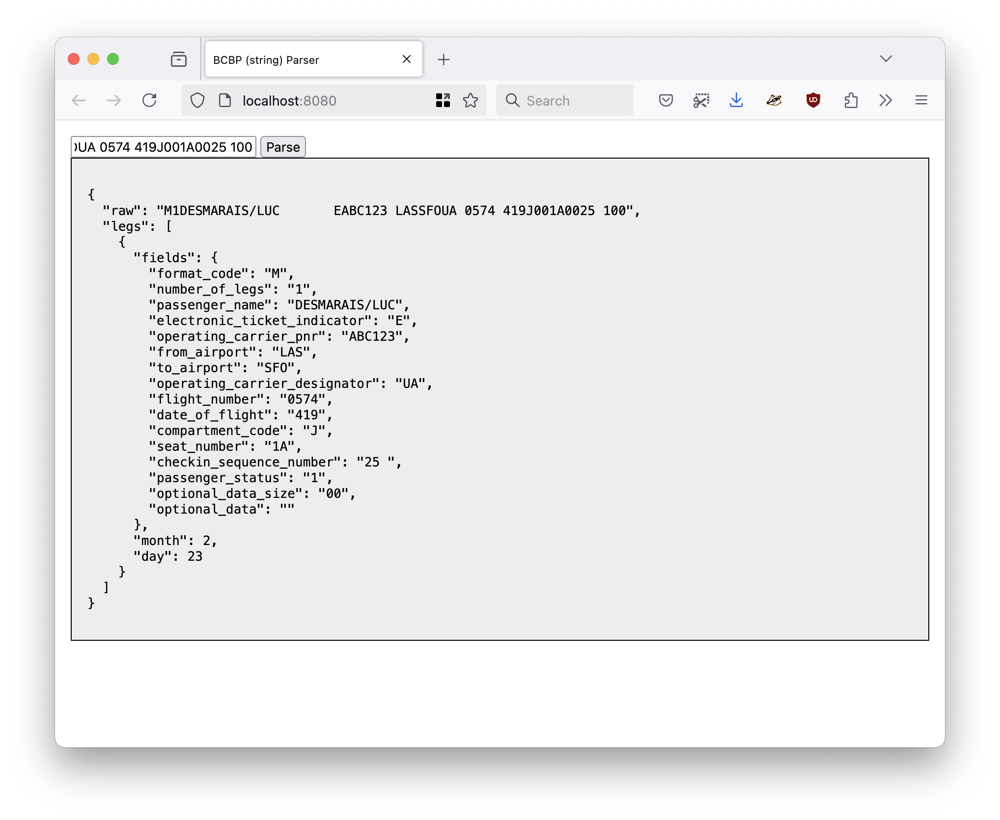

# go-bcbp-wasm

WebAssembly (WASM) binary to parse IATA BCBP strings using the [sfomuseum/go-bcbp](https://github.com/sfomuseum/go-bcbp) package, targeting JavaScript.

## parse_bcbp.wasm

```
<script src="javascript/wasm_exec.js"></script>
<script src="javascript/sfomuseum.wasm.js"></script>	

<script type="text/javascript">

sfomuseum.wasm.fetch("parse_bcbp.wasm").then(rsp => {

	var bcbp_str = "M1DESMARAIS/LUC       EABC123 LASSFOUA 0574 419J001A0025 100";

	parse_bcbp(bcbp_str).then(bcbp_rsp => {
		// Do something with bcbprsp
	}).catch(err => {
		console.error("Failed to parse BCBP string", err);
	});
	
}).catch(err => {
	console.error("Failed to initialize parse_bcbp.wasm", err)
});

</script>
```

_See [www](www) folder for a complete working example._

Where `rsp` looks like this:

```
{
  "raw": "M1DESMARAIS/LUC       EABC123 LASSFOUA 0574 419J001A0025 100",
  "legs": [
    {
      "fields": {
        "format_code": "M",
        "number_of_legs": "1",
        "passenger_name": "DESMARAIS/LUC",
        "electronic_ticket_indicator": "E",
        "operating_carrier_pnr": "ABC123",
        "from_airport": "LAS",
        "to_airport": "SFO",
        "operating_carrier_designator": "UA",
        "flight_number": "0574",
        "date_of_flight": "419",
        "compartment_code": "J",
        "seat_number": "1A",
        "checkin_sequence_number": "25 ",
        "passenger_status": "1",
        "optional_data_size": "00",
        "optional_data": ""
      },
      "month": 2,
      "day": 23
    }
  ]
}
```

## Example

```
$> make debug
fileserver \
		-root ./www \
		-server-uri http://localhost:8080 \
		-mimetype js=text/javascript \
		-mimetype wasm=application/wasm \
		-enable-cors
2025/02/21 15:36:14 Serving ./www and listening for requests on http://localhost:8080

```

For example:



## See also

* https://github.com/sfomuseum/go-bcbp